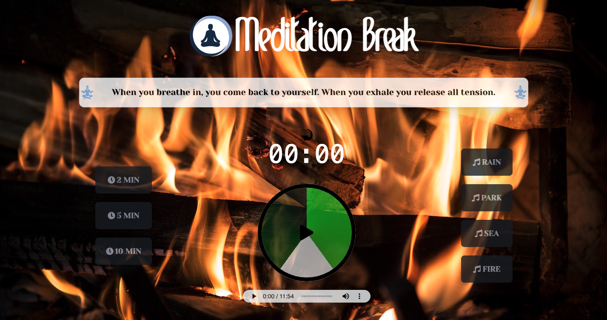

<p align="center">
  
  <h1 align="center">Meditation Break</h1>

  <p align="center">
    A meditation app that will help you at any time of the day. <br>
    Take a break, meditate and relax!
  </p>

  <br>
  <br>

  <div align='center'>
  
  </div>

</p>

<details open="open">
  <summary><h2 style="display: inline-block">Contents</h2></summary>
  <ol>
    <li>
      <a href="#about-the-project">About The Project</a>
      <ul>
        <li><a href="#home">Home</a></li>
        <li><a href="#meditation-page">Meditation Page</a></li>
        <li><a href="#built-with">Built With</a></li>
      </ul>
    </li>
    <li>
      <a href="#getting-started">Getting Started</a>
      <ul>
        <li><a href="#prerequisites">Prerequisites</a></li>
        <li><a href="#installation">Installation</a></li>
      </ul>
    </li>
    <li><a href="#license">License</a></li>
    <li><a href="#links-contacts">Links & Contacts</a></li>
  </ol>
</details>

## About The Project

I have created a meditation web app that allows you to meditate in a very simple way and follows you step by step with phrases that can help you lift your mood.

### Home

<br>
<div align='center'>

</div>
<br>
<br>
On the home page you are asked about the mood of the day, so the phrases that you will see scroll on the meditation page are customized according to your mood
<br>

### Meditation Page

<br>
<div align='center'>

</div>
<br>
On this page, phrases will appear every 10 seconds to help you improve your day and reflect on the benefits of meditation. <br>

In addition you can you can select the timer, reset it and set the sound you like best. <br>

Once the timer has started you will see the central circle expand and shrink with the rhythm of your breath, follow it and you will see how you will feel the well-being of a deep and accurate breath like the one that is guided to you in this web app.

<br>
<div align='center'>

</div>
<br>

### Built With

- [React](https://it.reactjs.org/)
- [Tailwind CSS](https://tailwindcss.com)
- [Daisy UI](https://daisyui.com/)
- [react-circular-progressbar](https://www.npmjs.com/package/react-circular-progressbar)
- [react-router-dom-v6](https://reactrouter.com/en/main)
- [react-icons](https://react-icons.github.io/react-icons)
- [Animate.css](https://animate.style/#best-practices)
- [react-toastify](https://www.npmjs.com/package/react-toastify)
- Background images and sounds were downloaded from [Pixabay](https://pixabay.com/it)

## Getting Started

### Prerequisites

To start the application you need to have Node.js installed on your computer, so to install the latest version run the following command:

```sh
npm install npm@latest -g
```

### Installation

1. Clone the repository with git in the path you prefer:

```sh
 git clone https://github.com/parrodiv/meditation-break.git
```

2. Install NPM packages

```sh
 npm install
```

3. Open app with:

```sh
  npm start / npm run start
```

## License

Distributed under the MIT License. See `LICENSE` for more information.

## Links & Contacts

Linkedin - [Alessandro Parrilla](https://www.linkedin.com/in/alessandro-parrilla-994931222/) - alessandro.parrilla.dev@gmail.com

Website: https://meditationbreak.netlify.app
